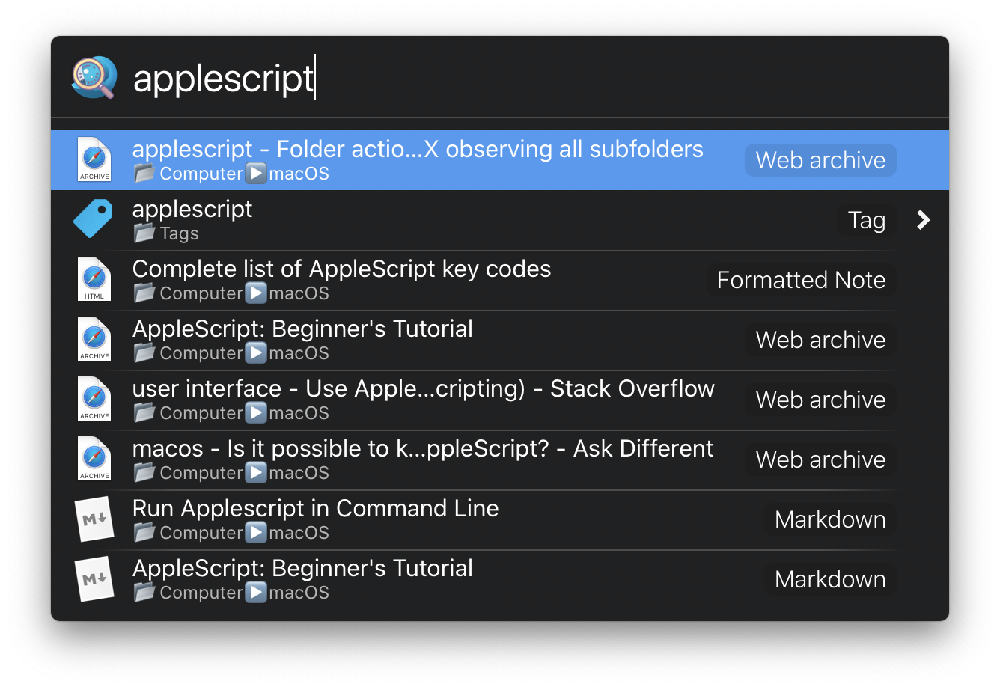
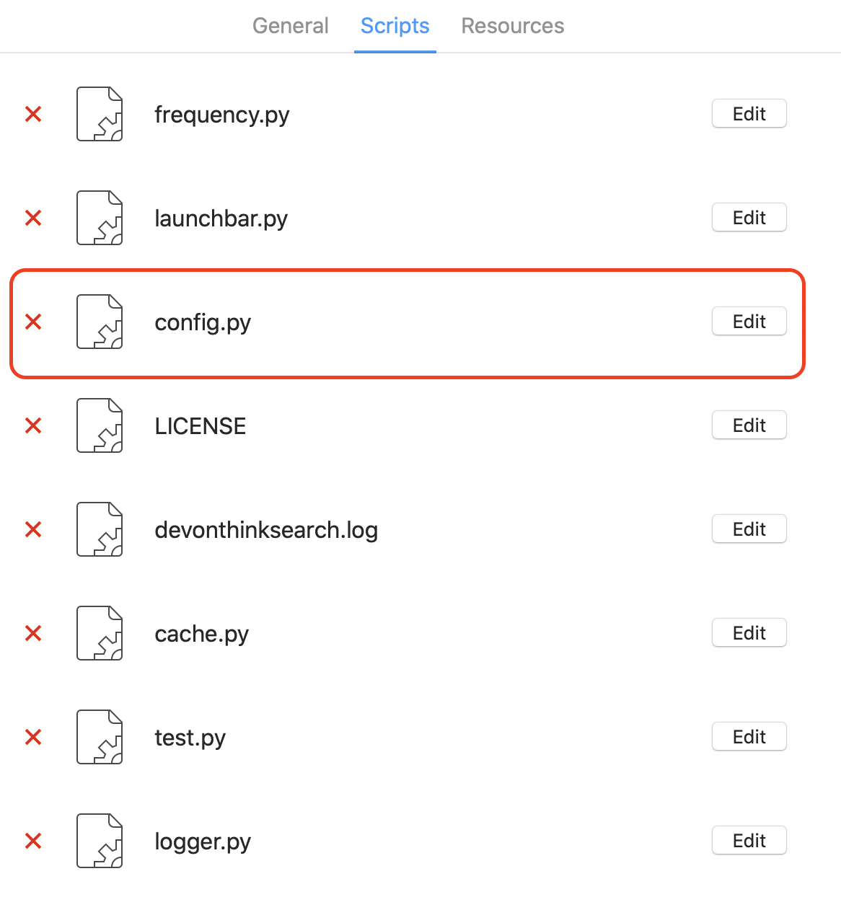

# DEVONthink Launchbar Search Tool
## What does it do?
It lets you search and navigate through DEVONthink effectively. It will learn from your habit so that the items get hitted most will appear on the top.

## How does it work?
Just enter the keyword and it will do a live and prefix search then nicely present the results for you.


### Modifier keys
If it is not a group:
- `⌘ + Enter` to reveal that item in DEVONthink
- `⇧ + Enter` to reveal that item in Finder
- `⌥ + Enter` to open that item externally

If it is a group:
- `⌘ + Enter` to reveal that item in DEVONthink
- `⌥ + Enter` to navigate through that group in Launchbar

Note that if you are already in "navigation mode", just press enter and you can navigate that group, press `⌥ + Enter` to open that group in DEVONthink.

### Excluded tag
If you tag a file/group `exclude-from-launchbar`, it will not be shown in the result.

## More details
### Frequency score
Except for the search score given by DEVONthink, the tool will adjust that score based on the frequency you open items.

`final_score = search_score + weight * frequency_score`


How do the tool calcuate the `frequency_score`?

Every time you choose a item, it update the frequency score of every item appears using the following formula.

`frequency_score = old_score * a + is_chosen (0 or 1) * (1 - a)`

What's the initial value? If the item is never chosen, its score remains to 0. The first time it is chosen, the score is set to a constant `b`, and will never drop below `b`.


### Config file
You can adjust all those values in the config file `config.py`.



Defualt values:

```python
a = 0.8
b = 0.5
frequency_weight = 2
excluded_tag = 'exclude-from-launchbar'
```